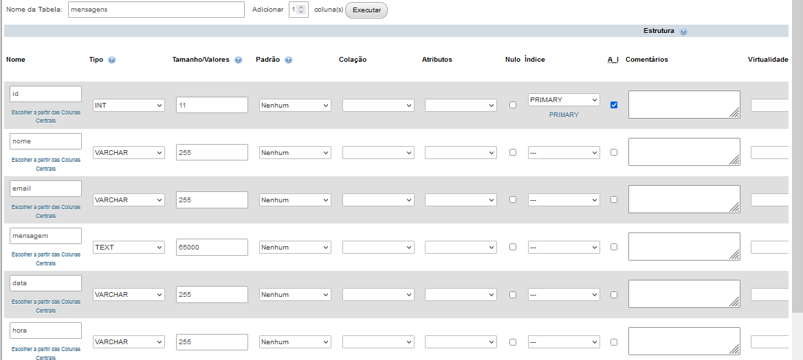

# Site Básico

## GitCli
1. Inicialmente foi criado o repositório no GitHub
2. Editor de código foi aberto na pasta do repositório local (/Meus projetos)
3. No terminal o editor `git clone [Endereço do repositório]`
4. `git status` na pasta do repositório clonado
5. `git add *` (para adicionar tudo a area de staged)
6. `git commit -m "menssagem do commit"`
7. `git push` para subir ao repositório remoto

## Etapa de construção do código
1. Primeiros passos no README
2. Estrutura inicial no HTML
3. Criado o Arquivo de CSS
4. Escolha da imagem no Pexels e tratamento no remuve.bg, https://www.photopea.com/
5. Terminado a estrutura do HTML e CSS
6. Etapa de JavaScript
7. Etapa de Responssividade

## Fase de DB e Sever
1. Primeiro foi instalado o XAMPP, onde trabalharemos com o mysql e com php
2. Como administrador no terminal navegamos até a pasta do xampp `C:\xampp\htdocs`
3. Comando `mklink /D meu_site C:\Users\avent\Desktop\Des_Web\Meu_projetos\Site2` onde foi criado um link para a pasta do projeto, caso contrário 
o prejeto teria que ser todo contruido dentro da pasta `C:\xampp\htdocs`
4. Iniciado o servidor atravez do console do XAMPP `Apache e MySql`

## Nessa fase o projeto sofrerá divisão em Branch's
1. `git fetch` Para ver se ha atualização no repositório remoto
2. `git status` Para verificar alterações no repositório local
3. `git branch` Para saber em que Branch estamos
4. `git checkout -b <nome_da_nova_branch>` Estando na *Branch main* este comando cria uma nova branch com o *nome_da_nova_branch* que é cópia da branch *main*
5. `git branch` Para saber verificar que já estamos na nova branch
6. Quando necessário voltar para alguma branch é o comando `git checkout <nome_da_brench>`
7. Após os primeiro commit na nova branch antes de fazer o primeiro push 
   `git push -u origin <nome_da_branch_sendo_criada>`   
isso criará também a nova branch no repositório remoto e só é necessário fazer uma unica vez.
8. Agora é `git push` normalmente
9.  Apartir desse momento diremos as branch's que serão atualizdas com `git push origin <nome_da_branch>`

## Codificação da segunda etapa
1. Criado o arquivo formulário e linkado no index por *marque sua consulta*
2. Codificando _formulario.html_ e _formulario.css_
3. iniciando etapa de backend com o arquivo ___processar_dados.php__

##DB
1. No painel do XANPP, aniona o botão admin do MySql
2. Em ___Novo__ Criar novo banco de dados
3. Criar __Tabela__ mensagens onde armazenará as informações do formulário com 6 colunas depois botão __salvar__
4. 
5. 